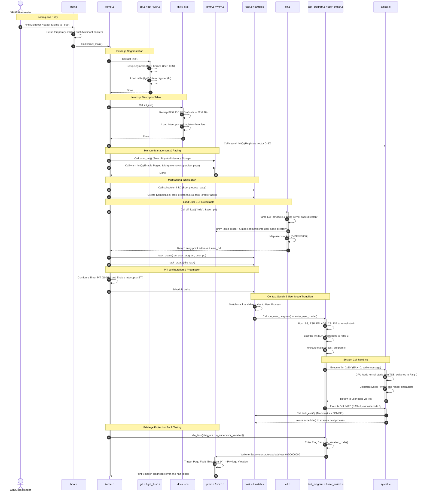

# 🪐 MyOS: Custom 32-bit x86 Preemptive Multitasking Operating System

Welcome to **MyOS**, a custom-built 32-bit x86 operating system written in C and Assembly. It features a complete boot system, segmentation (GDT), hardware/software interrupts (IDT/ISRs), page-based virtual memory management (PMM/VMM) with demand paging, preemptive multitasking, a Virtual File System (VFS) with a TAR ramdisk, and dynamic ELF executable loading with user-mode (Ring 3) transitions and system calls.

---

## 🗺️ System Architecture & Core Concepts

### 1. Booting & Multiboot Specification
Before the kernel runs, it must be loaded into memory by a bootloader. This OS complies with the [Multiboot Specification](https://wiki.osdev.org/Multiboot), which allows bootloaders like GRUB to load the kernel image.
* **Multiboot Header**: Located at the very beginning of the kernel binary via [boot.s](file:///c:/Users/Timson%20Yap/Desktop/Test%20lab/src/boot.s). It contains a magic number (`0x1BADB002`), flags (specifying 4KB page alignment for sections and requesting memory info), and a checksum.
* **Initialization**: The bootloader loads the kernel executable into physical memory at `1MB` (avoiding memory mapped IO and BIOS structures below 1MB, as configured in [linker.ld](file:///c:/Users/Timson%20Yap/Desktop/Test%20lab/src/linker.ld)), puts the magic signature in `EAX`, the multiboot structure pointer in `EBX`, and jumps to the entry point `_start` in [boot.s](file:///c:/Users/Timson%20Yap/Desktop/Test%20lab/src/boot.s).
* **Reference**: [OSDev Wiki - Multiboot](https://wiki.osdev.org/Multiboot)

### 2. Global Descriptor Table (GDT) & Task State Segment (TSS)
The x86 architecture uses segmentation to partition memory and enforce privilege rings.
* **GDT**: Defines segments that span the entire 4GB virtual address space but have different access rights. [gdt.c](file:///c:/Users/Timson%20Yap/Desktop/Test%20lab/src/gdt.c) initializes 5 segments:
  1. *Null Segment* (Required by CPU)
  2. *Kernel Code Segment* (Ring 0, Executable/Readable)
  3. *Kernel Data Segment* (Ring 0, Readable/Writable)
  4. *User Code Segment* (Ring 3, Executable/Readable)
  5. *User Data Segment* (Ring 3, Readable/Writable)
* **TSS**: The Task State Segment holds the kernel stack pointer (`esp0`) and segment selector (`ss0`) that the CPU automatically switches to when a privilege transition occurs (e.g., when a Ring 3 user process triggers an interrupt or system call and shifts to Ring 0).
* **Reference**: [OSDev Wiki - Global Descriptor Table](https://wiki.osdev.org/Global_Descriptor_Table) and [OSDev Wiki - Task State Segment](https://wiki.osdev.org/Task_State_Segment)

### 3. Interrupt Descriptor Table (IDT), ISRs, & PIC Remapping
Interrupts allow the CPU to respond immediately to external hardware events or internal processor exceptions.
* **IDT**: The table that maps interrupt vectors (0–255) to their respective handlers. [idt.c](file:///c:/Users/Timson%20Yap/Desktop/Test%20lab/src/idt.c) constructs the IDT gates.
* **PIC Remapping**: The 8259 Programmable Interrupt Controllers map hardware interrupts to vectors. By default, they conflict with CPU exceptions (vectors 0–31). [idt.c](file:///c:/Users/Timson%20Yap/Desktop/Test%20lab/src/idt.c) remaps Master PIC to vector 32 (IRQ 0-7) and Slave PIC to vector 40 (IRQ 8-15) via I/O commands to ports `0x20`/`0x21` and `0xA0`/`0xA1`.
* **ISRs**: Assembly stubs in [isr.s](file:///c:/Users/Timson%20Yap/Desktop/Test%20lab/src/isr.s) catch the interrupts, push the register state to stack, load the kernel data selector (`0x10`), call C functions `isr_dispatch` or `irq_dispatch`, and then return via `iret`.
* **Syscall Vector**: Interrupt `0x80` (128) is registered with User privilege flag (`DPL=3`), enabling user programs to execute it.
* **Reference**: [OSDev Wiki - Interrupt Descriptor Table](https://wiki.osdev.org/Interrupt_Descriptor_Table) and [OSDev Wiki - 8259 PIC](https://wiki.osdev.org/8259_PIC)

### 4. Memory Management (PMM & VMM)
Memory is split into physical page frames and virtual pages, each 4KB in size.
* **Physical Memory Manager (PMM)**: Implemented in [pmm.c](file:///c:/Users/Timson%20Yap/Desktop/Test%20lab/src/pmm.c). It parses the Multiboot memory map to discover usable memory and tracks allocations using a bitmap. Each bit represents a 4KB physical block (1 for reserved/allocated, 0 for free). It reserves BIOS regions, the kernel image, GRUB ramdisk module, and the PMM bitmap itself.
* **Virtual Memory Manager (VMM)**: Implemented in [vmm.c](file:///c:/Users/Timson%20Yap/Desktop/Test%20lab/src/vmm.c). It sets up x86 2-level paging. It allocates a Page Directory pointing to Page Tables.
* **Page Protection**: Virtual pages can be flagged as supervisor-only or user-accessible. Page `0xD0000000` is mapped without user flags as a supervisor test page. Accessing it from Ring 3 triggers a privilege page fault.
* **Demand Paging**: Writing to unmapped virtual memory in range `[0x1000, 0xC0000000)` causes page fault exception 14. The page fault handler intercepts this, allocates a physical block on-the-fly, maps it, and lets the instruction resume seamlessly.
* **Reference**: [OSDev Wiki - Page Frame Allocator](https://wiki.osdev.org/Page_Frame_Allocator) and [OSDev Wiki - Paging](https://wiki.osdev.org/Paging)

### 5. Multitasking, Preemption, & Context Switching
* **Tasks**: Represented by `task_t` in [task.h](file:///c:/Users/Timson%20Yap/Desktop/Test%20lab/src/task.h), which stores the process ID (PID), its saved stack pointer (`esp`), page directory pointer (`cr3`), kernel stack top (`kstack`), state, and queue link.
* **Context Switching**: Implemented in assembly in [switch.s](file:///c:/Users/Timson%20Yap/Desktop/Test%20lab/src/switch.s). It saves callee-saved registers (EBP, EBX, ESI, EDI) of the current task, stores `ESP` to the task control block, loads the next task's saved `ESP` to `ESP`, switches the `CR3` register to the next task's page directory if it differs (flushing TLB caches), calls `tss_set_kernel_stack` to update TSS, restores callee-saved registers, and returns.
* **PIT**: The Programmable Interval Timer in [timer.c](file:///c:/Users/Timson%20Yap/Desktop/Test%20lab/src/timer.c) generates interrupts at 100Hz (IRQ 0). Its interrupt handler invokes `schedule()` to switch tasks preemptively.
* **Reference**: [OSDev Wiki - Multitasking](https://wiki.osdev.org/Multitasking) and [OSDev Wiki - Context Switch](https://wiki.osdev.org/Context_Switch)

### 6. User Mode (Ring 3) Transition & System Calls
Executing untrusted user binaries requires stepping down CPU execution privilege to Ring 3.
* **Ring 3 Jump**: Performed in [user_switch.s](file:///c:/Users/Timson%20Yap/Desktop/Test%20lab/src/user_switch.s) by pushing User Data segment selector (`0x23`), target User Stack Pointer, EFLAGS (with Interrupt Flag enabled), User Code Segment selector (`0x1B`), and target User Entry address onto the stack. It then executes `iret` to force the CPU privilege change.
* **ELF Loading**: The loader in [elf.c](file:///c:/Users/Timson%20Yap/Desktop/Test%20lab/src/elf.c) validates ELF magic headers, clones the kernel page directory, reads `PT_LOAD` segments, maps memory pages to the process directory, copies executable contents, and allocates a stack page at `0xBFFF0000`.
* **System Calls**: When user space executes software interrupt `int $0x80`, the CPU switches to the kernel stack saved in the TSS, transitions to Ring 0, and dispatches the call to [syscall.c](file:///c:/Users/Timson%20Yap/Desktop/Test%20lab/src/syscall.c). The return value is placed in `EAX`.
* **Reference**: [OSDev Wiki - ELF](https://wiki.osdev.org/ELF) and [OSDev Wiki - System Calls](https://wiki.osdev.org/System_Calls)

### 7. File System & RAM Disk
* **TAR RAM Disk**: The ramdisk is passed by GRUB as a multiboot module (`initrd.tar` in USTAR format). [tar.c](file:///c:/Users/Timson%20Yap/Desktop/Test%20lab/src/tar.c) parses the file headers, extracts names/sizes, and registers them.
* **VFS**: Virtual File System abstraction in [vfs.c](file:///c:/Users/Timson%20Yap/Desktop/Test%20lab/src/vfs.c) provides standard read interfaces, routing path lookups to directory drivers.

---

## 📂 Source Code Map

| File | Description | Key Symbols & Links |
| :--- | :--- | :--- |
| **`src/boot.s`** | Assembly entry point. Declares Multiboot header and boots kernel. | `_start` |
| **`src/linker.ld`** | Defines kernel memory layout starting at 1MB boundary. | `_kernel_end` |
| **`src/kernel.c`** | Main entry point that orchestrates hardware initialization and executes tests. | [kernel_main](file:///c:/Users/Timson%20Yap/Desktop/Test%20lab/src/kernel.c#L59), `taskA`, `taskB`, `run_user_program`, `user_violation_code` |
| **`src/gdt.c`** / **`.h`** | Allocates and loads GDT segments and registers the Task State Segment (TSS). | [gdt_init](file:///c:/Users/Timson%20Yap/Desktop/Test%20lab/src/gdt.c#L22), [tss_set_kernel_stack](file:///c:/Users/Timson%20Yap/Desktop/Test%20lab/src/gdt.c#L50) |
| **`src/gdt_flush.s`** | Assembly helper that loads the descriptor table and resets code/data registers. | [gdt_flush](file:///c:/Users/Timson%20Yap/Desktop/Test%20lab/src/gdt_flush.s#L5) |
| **`src/idt.c`** / **`.h`** | Allocates IDT table, maps PIC vectors, and handles exception/IRQ dispatching. | [idt_init](file:///c:/Users/Timson%20Yap/Desktop/Test%20lab/src/idt.c#L39), `isr_dispatch`, `irq_dispatch` |
| **`src/isr.s`** | Assembly exception/IRQ wrappers that push registers and branch to C handlers. | `isr_common_stub`, `irq_common_stub` |
| **`src/pmm.c`** / **`.h`** | Page-frame allocator using a bitmap to manage physical memory allocations. | [pmm_init](file:///c:/Users/Timson%20Yap/Desktop/Test%20lab/src/pmm.c#L40), [pmm_alloc_block](file:///c:/Users/Timson%20Yap/Desktop/Test%20lab/src/pmm.c#L105), `pmm_free_block` |
| **`src/vmm.c`** / **`.h`** | Implements two-level paging, page mapping/unmapping, and demand paging. | [vmm_init](file:///c:/Users/Timson%20Yap/Desktop/Test%20lab/src/vmm.c#L79), `vmm_map_page`, [page_fault_handler](file:///c:/Users/Timson%20Yap/Desktop/Test%20lab/src/vmm.c#L103) |
| **`src/task.c`** / **`.h`** | Task control structures, scheduler queues, and scheduling routines. | [scheduler_init](file:///c:/Users/Timson%20Yap/Desktop/Test%20lab/src/task.c#L46), [task_create](file:///c:/Users/Timson%20Yap/Desktop/Test%20lab/src/task.c#L59), [schedule](file:///c:/Users/Timson%20Yap/Desktop/Test%20lab/src/task.c#L90) |
| **`src/switch.s`** | Context switching logic saving current register states and reloading new ones. | [switch_task](file:///c:/Users/Timson%20Yap/Desktop/Test%20lab/src/switch.s#L6) |
| **`src/user_switch.s`**| Low-level privilege segment and instruction pointer manipulation for Ring 3 transition. | [enter_user_mode](file:///c:/Users/Timson%20Yap/Desktop/Test%20lab/src/user_switch.s#L5) |
| **`src/elf.c`** / **`.h`** | ELF binary parser, section mapper, and task process mapping loader. | [elf_load](file:///c:/Users/Timson%20Yap/Desktop/Test%20lab/src/elf.c#L41) |
| **`src/syscall.c`** / **`.h`**| System call registration and dispatcher handling outputs and process exits. | [syscall_init](file:///c:/Users/Timson%20Yap/Desktop/Test%20lab/src/syscall.c#L26), `syscall_dispatch` |
| **`src/tar.c`** / **`.h`** | Initrd RAM disk filesystem driver reading files inside the GRUB USTAR archive. | [tar_init](file:///c:/Users/Timson%20Yap/Desktop/Test%20lab/src/tar.c#L70) |
| **`src/vfs.c`** / **`.h`** | File system abstraction layer supporting paths and file node traversal. | [find_node_by_path](file:///c:/Users/Timson%20Yap/Desktop/Test%20lab/src/vfs.c#L28), `read_fs` |
| **`src/timer.c`** / **`.h`** | Programmable Interval Timer (PIT) setup generating periodic tick interrupts. | `timer_init`, `timer_callback` |
| **`src/terminal.c`** / **`.h`**| VGA text mode video memory driver formatting stdout prints. | `terminal_init`, `printf`, `terminal_putchar` |
| **`src/string.c`** / **`.h`** | Basic library string utilities (`strcmp`, `strcpy`, `memset`, `memcpy`). | `strcmp`, `memcpy` |
| **`src/test_program.c`**| User application compiled into an ELF file that runs in Ring 3 and issues syscalls. | `main`, `syscall_write`, `syscall_exit` |
| **`Makefile`** | Compilation, archiver, link script, and boot ISO constructor instructions. | N/A |
| **`Dockerfile`** | Container template carrying GCC multilib cross compilers and ISO tools. | N/A |
| **`grub.cfg`** | Configuration specifying the kernel executable and module locations. | N/A |

---

## 🔄 Program Execution Lifecycle

This diagram demonstrates how all these modules and source files interact sequentially during kernel boot, thread execution, and user mode testing:



---

## 🚶 Code Walkthrough (Minimalist)

This section maps out key source components and how they function at a code level with minimal explanation:

### 1. Bootstrapping
* **[boot.s](file:///c:/Users/Timson%20Yap/Desktop/Test%20lab/src/boot.s)**: Defines the Multiboot header, sets up a temporary 16KB kernel stack, and jumps to [kernel_main](file:///c:/Users/Timson%20Yap/Desktop/Test%20lab/src/kernel.c#L59).
* **[linker.ld](file:///c:/Users/Timson%20Yap/Desktop/Test%20lab/src/linker.ld)**: Directs the linker to load the kernel binary beginning at physical address `1MB`.

### 2. Privilege Segmentation & Interrupts
* **[gdt.c](file:///c:/Users/Timson%20Yap/Desktop/Test%20lab/src/gdt.c)**: [gdt_init](file:///c:/Users/Timson%20Yap/Desktop/Test%20lab/src/gdt.c#L22) defines 5 segments (Null, Ring 0 Code/Data, Ring 3 Code/Data) plus the TSS. TSS's `esp0` stack pointer is loaded via [tss_set_kernel_stack](file:///c:/Users/Timson%20Yap/Desktop/Test%20lab/src/gdt.c#L50) to allow safe user-to-kernel transitions.
* **[gdt_flush.s](file:///c:/Users/Timson%20Yap/Desktop/Test%20lab/src/gdt_flush.s)**: Assembler helper that loads the descriptor table (`lgdt`) and updates segment selectors.
* **[idt.c](file:///c:/Users/Timson%20Yap/Desktop/Test%20lab/src/idt.c)**: [idt_init](file:///c:/Users/Timson%20Yap/Desktop/Test%20lab/src/idt.c#L39) registers gates for exceptions, hardware IRQs (PIC remapping to offsets 32 and 40), and syscall vector `0x80` (`DPL=3`).
* **[isr.s](file:///c:/Users/Timson%20Yap/Desktop/Test%20lab/src/isr.s)**: Low-level interrupt handlers wrapping execution by saving registers, calling [isr_dispatch](file:///c:/Users/Timson%20Yap/Desktop/Test%20lab/src/idt.c#L120) or [irq_dispatch](file:///c:/Users/Timson%20Yap/Desktop/Test%20lab/src/idt.c#L136) in C, and returning via `iret`.

### 3. Physical & Virtual Memory Management
* **[pmm.c](file:///c:/Users/Timson%20Yap/Desktop/Test%20lab/src/pmm.c)**: [pmm_init](file:///c:/Users/Timson%20Yap/Desktop/Test%20lab/src/pmm.c#L40) uses a bitmap to manage physical page frames (1 bit = 4KB page). [pmm_alloc_block](file:///c:/Users/Timson%20Yap/Desktop/Test%20lab/src/pmm.c#L105) allocates a frame, and [pmm_free_block](file:///c:/Users/Timson%20Yap/Desktop/Test%20lab/src/pmm.c#L124) frees it.
* **[vmm.c](file:///c:/Users/Timson%20Yap/Desktop/Test%20lab/src/vmm.c)**: [vmm_init](file:///c:/Users/Timson%20Yap/Desktop/Test%20lab/src/vmm.c#L79) sets up 2-level paging. [page_fault_handler](file:///c:/Users/Timson%20Yap/Desktop/Test%20lab/src/vmm.c#L103) intercepts faults (Exception 14).
  * **Privilege Violation**: Halts on accessing supervisor-only page `0xD0000000`.
  * **Demand Paging**: Catches accesses between `0x1000` and `0xC0000000`, calls [pmm_alloc_block](file:///c:/Users/Timson%20Yap/Desktop/Test%20lab/src/pmm.c#L105), maps virtual to physical on the fly via [vmm_map_page](file:///c:/Users/Timson%20Yap/Desktop/Test%20lab/src/vmm.c#L13), and resumes instruction.

### 4. Multitasking & Context Switching
* **[task.c](file:///c:/Users/Timson%20Yap/Desktop/Test%20lab/src/task.c)**: Manages task control blocks (`task_t`). [task_create](file:///c:/Users/Timson%20Yap/Desktop/Test%20lab/src/task.c#L59) creates tasks. `schedule` pops the next task from the scheduler queue.
* **[switch.s](file:///c:/Users/Timson%20Yap/Desktop/Test%20lab/src/switch.s)**: `switch_task` saves current task register context, switches stack (`esp`), loads the next page directory (`cr3`), updates the TSS kernel stack, and restores register context.
* **[timer.c](file:///c:/Users/Timson%20Yap/Desktop/Test%20lab/src/timer.c)**: Sets up the PIT timer at 100Hz (IRQ 0) calling `schedule` for preemptive multitasking.

### 5. Ring 3 Transitions & ELF Loading
* **[elf.c](file:///c:/Users/Timson%20Yap/Desktop/Test%20lab/src/elf.c)**: [elf_load](file:///c:/Users/Timson%20Yap/Desktop/Test%20lab/src/elf.c#L41) parses ELF files, clones the kernel page directory, maps program segments (`PT_LOAD`), allocates the user stack at `0xBFFF0000`, and returns the entry point.
* **[user_switch.s](file:///c:/Users/Timson%20Yap/Desktop/Test%20lab/src/user_switch.s)**: `enter_user_mode` pushes Ring 3 stack/code selectors and addresses, executing `iret` to drop privilege levels.
* **[syscall.c](file:///c:/Users/Timson%20Yap/Desktop/Test%20lab/src/syscall.c)**: Catches software interrupt `int 0x80`, transitions to Ring 0, and dispatches to system functions like `write` or `exit`.

### 6. RAM Disk & File Systems
* **[tar.c](file:///c:/Users/Timson%20Yap/Desktop/Test%20lab/src/tar.c)**: Parses the bootloader-loaded `initrd.tar` archive headers.
* **[vfs.c](file:///c:/Users/Timson%20Yap/Desktop/Test%20lab/src/vfs.c)**: Abstracts read/lookup paths to route system directories via `read_fs`.

---

## 🛠️ How to Compile & Run the Operating System

You can compile the operating system directly on the host machine or isolate the build dependencies within a Docker container.

### Method 1: Docker Build (Recommended, Cross-Platform)
Since building x86 kernels requires cross-compilation configurations (`-m32`, `nasm`, and ISO tools like `grub-mkrescue`/`xorriso`), using Docker is the cleanest option for both Windows and Linux hosts.

#### Prerequisites
* Install [Docker Desktop](https://www.docker.com/products/docker-desktop/) (Windows) or Docker Engine (Linux).
* Install [QEMU](https://www.qemu.org/download/) to execute the compiled OS.
  * **Windows**: Run `choco install qemu` or download the installer.
  * **Linux (Ubuntu/Debian)**: `sudo apt install qemu-system-x86`

#### Compilation Steps
1. Open a terminal (PowerShell for Windows, Bash for Linux) in the project directory.
2. Build the compilation environment image:
   ```bash
   docker build -t myos-builder .
   ```
3. Run the container to build the bootable ISO file:
   * **Windows (PowerShell)**:
     ```powershell
     docker run --rm -v ${PWD}:/workspace myos-builder make clean all
     ```
   * **Linux (Bash)**:
     ```bash
     docker run --rm -v $(pwd):/workspace myos-builder make clean all
     ```
This creates the file `myos.iso` directly in the project directory.

---

### Method 2: Native Host Build

#### On Linux (Ubuntu / Debian)
1. Install the compilers, assemblers, and utility libraries:
   ```bash
   sudo apt update
   sudo apt install -y build-essential gcc-multilib nasm grub-pc-bin xorriso qemu-system-x86
   ```
2. Build the OS:
   ```bash
   make clean all
   ```

#### On Windows (WSL - Windows Subsystem for Linux)
1. Open a WSL shell (e.g., Ubuntu).
2. Install the required build suite:
   ```bash
   sudo apt update
   sudo apt install -y build-essential gcc-multilib nasm grub-pc-bin xorriso qemu-system-x86
   ```
3. Navigate to the project directory (e.g., `/mnt/c/Users/.../Test lab/`) and build:
   ```bash
   make clean all
   ```

---

### 🚀 Running the Operating System via QEMU

Once `myos.iso` is successfully compiled, execute it in the emulator.

#### On Windows (Command Prompt / PowerShell)
Run:
```cmd
qemu-system-i386 -cdrom myos.iso
```
*(If QEMU is not in your environment variable PATH, specify the full executable path, e.g., `"C:\Program Files\qemu\qemu-system-i386.exe" -cdrom myos.iso`)*.

#### On Linux / WSL
Run:
```bash
qemu-system-i386 -cdrom myos.iso
```
* **WSL Tip**: If running inside WSL, make sure a display server is running (like WSLg or VcXsrv). Alternatively, use the `-nographic` or `-curses` switch to redirect console input/output:
  ```bash
  qemu-system-i386 -cdrom myos.iso -display curses
  ```

---

## 🔍 Expected Output / Test in Action

When you run **MyOS** in QEMU, the VGA console will display a detailed diagnostic startup log showing the hardware initialization, memory tests, multitasking execution, and privilege protection failure. 

Below is the expected console output:

```text
🪐 MyOS: Custom 32-bit x86 Operating System booting...
[GDT] Initialized segments and loaded TSS.
[IDT] Initialized interrupt gates.
[Syscall] Registered vector 128 (0x80) handler.
[PMM] Initialized page frame allocator.

--- Running PMM Diagnostics ---
[PMM] Allocated block 1: 10a000
[PMM] Allocated block 2: 10b000
[PMM] Freed block 1.
[PMM] Allocated block 3 (should reuse block 1 address): 10a000
[PMM] Success: Block reuse verified via first-fit logic.
[VMM] Enabled 2-level paging.

--- Running VMM Verification ---
[VMM] Test A: Mapped virtual 0xa0000000 to physical 10c000
[VMM] Test A: Read value from 0xa0000000 = cafebabe
[VMM] Test A: Passed!
[VMM] Test B: Writing to unmapped virtual address 0x40000000...
[VMM] DEMAND PAGING: Mapped virtual 40000000 to physical 10d000
[VMM] Test B: Read value from 0x40000000 = 12345678
[VMM] Test B (Demand Paging): Passed!
[TAR] Initializing RAM Disk. module start: 10e000, end: 114000
[TAR] Registered file: hello (size: 13256 bytes)
[Scheduler] Multi-threading environment ready.
[ELF] Loaded 'hello' from RAM disk. Entry point: 8048080
[Timer] PIT configured at 100Hz.

[Kernel] Enabling interrupts (STI) and entering preemptive multitasking...
[Task A] Tick 0
[Task B] Tick 0
[Task A] Tick 1
[Task B] Tick 1

[User ELF] Hello World from Ring 3! Executing ELF loaded dynamically from TAR RAM disk.
[User ELF] Program finished. Calling exit syscall with code 5.
[Scheduler] Task 4 exited with code 5
[Task A] Tick 2
[Task B] Tick 2
[Task A] Tick 3
[Task B] Tick 3
[Task A] Tick 4
[Task B] Tick 4
[Task A] Completed.
[Task B] Completed.

[Kernel] Starting Supervisor Protection Test...
[User Ring 3] Executing violation code, attempting to write to supervisor page 0xD0000000...

[VMM] PRIVILEGE VIOLATION! Access to supervisor page at d0000000 denied.
EIP: 1004a2, Error Code: 7 (Present: 1, Write: 1, User: 1)
Halting system.
```

### 📋 Detailed Step-by-Step Explanation of Output

1. **Kernel Initialization**
   * The kernel sets up the display, registers privilege segment maps (GDT) and task switches (TSS), maps interrupt gates (IDT), maps syscall interrupts (`0x80`), and detects memory bounds using Multiboot headers.
2. **PMM Memory Block Reuse Verification**
   * The Physical Memory Manager allocates physical page block 1 at address `0x10a000` and page block 2 at `0x10b000`.
   * It then frees page block 1 and allocates block 3. Because of the first-fit allocator logic, page 3 reuses address `0x10a000`, confirming memory reclamation.
3. **VMM Map & Access Verification (Test A)**
   * Virtual address `0xa0000000` is mapped directly to physical address `0x10c000`.
   * The kernel writes `0xCAFEBABE` to virtual `0xa0000000`, reads it back to confirm a matching value, and then unmaps the page directory entry.
4. **VMM Demand Paging Verification (Test B)**
   * The kernel attempts to write `0x12345678` to virtual address `0x40000000`, which is unmapped.
   * This triggers a Page Fault (Exception 14).
   * The `page_fault_handler` detects the fault is caused by a non-present page (`!present`), dynamically allocates physical page `0x10d000`, maps it on the fly to virtual `0x40000000`, and resumes execution. The instruction completes successfully.
5. **Initial Ramdisk & Executable Load**
   * The kernel processes the TAR file `initrd.tar` loaded by GRUB, finding the ELF file `hello`.
   * The ELF loader clones the page tables, loads program segments, allocates user stacks at `0xBFFF0000`, and schedules the task.
6. **Task Scheduling & Preemption**
   * Preemptive multitasking is activated via PIT timer ticks. Tasks `A` and `B` yield execution to one another by executing `schedule()`.
   * The user-mode process `hello` transitions to Ring 3, executes its instructions, invokes the system calls `SYSCALL_WRITE` and `SYSCALL_EXIT` via software interrupt `int $0x80`, and gets reaped as exit code `5` is received by the scheduler.
7. **Privilege Ring Protection Verification**
   * Once kernel worker tasks finish execution, the idle loop starts a Ring 3 supervisor security violation test.
   * The test transitions back to Ring 3 user mode and attempts to write to virtual address `0xD0000000`.
   * Since this virtual page is mapped *without* user access permissions (supervisor-only), the processor instantly triggers a Page Fault (Exception 14).
   * The page fault handler recognizes a privilege violation, dumps diagnostic register state registers, and safely halts execution to prevent memory corruption.

